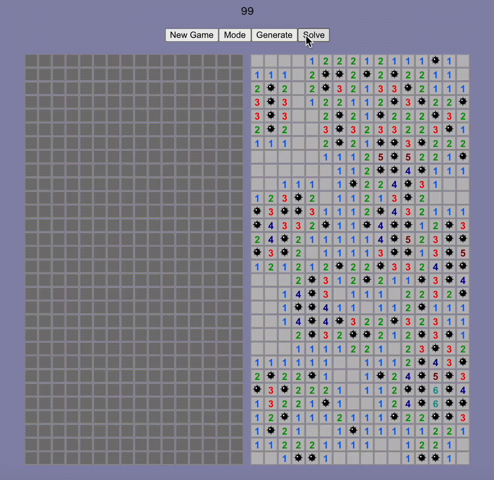

# minesweeper.ai
A python solver which plays Minesweeper optimally probabilistically (it achieves a 41% win rate on expert mode with a guaranteed non-mine first move), along with a front end that uncovers tiles in real-time. 

